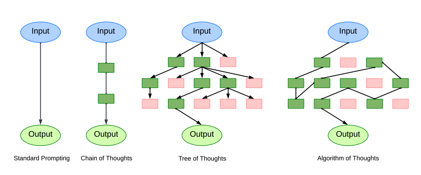

[](https://discord.gg/qUtxnK2NMf)

# Algorithm-Of-Thoughts

The open source implementation of "Algorithm of Thoughts: Enhancing Exploration of Ideas in Large Language Models"

[Algorithm of Thoughts: Enhancing Exploration of Ideas in Large Language Models](https://arxiv.org/abs/2308.10379)

# Installation
`pip install aot-x`


# Usage
```python
from aot import AoT

system_prompt = """

Use numbers and basic arithmetic operations (+ - * /) to obtain 24. When
considering the next steps, do not choose operations that will result in a
negative or fractional number. In order to help with the calculations, the
numbers in the parenthesis represent the numbers that are left after the
operations and they are in descending order.
Another thing we do is when there are only two numbers left in the parenthesis, we
check whether we can arrive at 24 only by using basic arithmetic operations
(+ - * /). Some examples regarding this idea:
(21 2) no
since 21 + 2 = 23, 21 - 2 = 19, 21 * 2 = 42, 21 / 2 = 10.5, none of which is equal
to 24.
(30 6) 30 - 6 = 24 yes
(8 3) 8 * 3 = 24 yes
(12 8) no
(48 2) 48 / 2 = 24 yes
Most importantly, do not give up, all the numbers that will be given has indeed a
solution.

14 8 8 2
"""


task = "5 10 5 2 "


aot = AoT(task=task, system_prompt=system_prompt)
aot.run()
```

# Todo
- [ ] All thoughts over 0.5 are added to cache or longterm vectorstore 
- [ ] DFS search similiar to tree of thoughts
- [ ] Propose solutions function
- [ ] Backtrack to nearest successful states
- [ ] Implement evaluation strategy similiar to tot with [0.0, 1.0]
- [ ] Working demo: Conducts search then backtracks through states, provide visuals green text
- [ ] Streamlit demo


## Citation
```
@misc{2308.10379,
Author = {Bilgehan Sel and Ahmad Al-Tawaha and Vanshaj Khattar and Lu Wang and Ruoxi Jia and Ming Jin},
Title = {Algorithm of Thoughts: Enhancing Exploration of Ideas in Large Language Models},
Year = {2023},
```